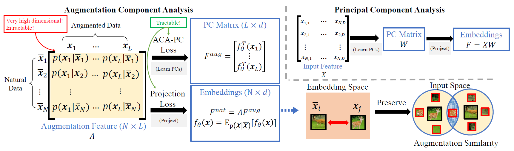

# Augmentation Component Analysis : Modeling Similarity via the Augmentation Overlaps

The code repository for "[Augmentation Component Analysis : Modeling Similarity via the Augmentation Overlaps](https://arxiv.org/abs/2206.00471)" (ICLR'23)
in PyTorch. If you use any content of this repo for your work, please cite the following bib entry:

```
@inproceedings{han2023augmentation,
  title={Augmentation Component Analysis: Modeling Similarity via the Augmentation Overlaps},
  author={Han, Lu and Ye, Han-Jia and Zhan, De-Chuan},
  booktitle={ICLR},
  year={2023}
}
```

## Abstract

Self-supervised learning aims to learn a embedding space where semantically similar samples are close. Contrastive
learning methods pull views of samples together and push different samples away, which utilizes semantic invariance of
augmentation but ignores the relationship between samples. To better exploit the power of augmentation, we observe that
semantically similar samples are more likely to have similar augmented views. Therefore, we can take the augmented views
as a special description of a sample. In this paper, we model such a description as the augmentation distribution and we
call it augmentation feature. The similarity in augmentation feature reflects how much the views of two samples overlap
and is related to their semantical similarity. Without computational burdens to explicitly estimate values of the
augmentation feature, we propose Augmentation Component Analysis (ACA) with a contrastive-like loss to learn principal
components and an on-the-fly projection loss to embed data. ACA equals an efficient dimension reduction by PCA and
extracts low-dimensional embeddings, theoretically preserving the similarity of augmentation distribution between
samples. Empirical results show our method can achieve competitive results against various traditional contrastive
learning methods on different benchmarks.



## Prerequisites

- attrs==21.2.0
- lightly==1.2.35
- matplotlib==3.4.2
- numpy==1.22.4
- pytorch_lightning==1.6.3
- torch==1.8.1
- torchvision==0.9.1
- tqdm==4.61.0

## Scripts

### cifar10

```shell
python main.py --model aca --lr 0.003 --gpus 0 \
 --max_epochs 800 --scheduler step --point 200 100 --val_every_n_epoch 4 --dataset cifar10 \
 --wd 1e-6 --optim adam --warmup --train_transform simclr --temperature 0.5 --lamb 1.0
```

### cifar100

```shell
python main.py --model aca --lr 0.003 --gpus 0 \
 --max_epochs 800 --scheduler step --point 200 100 --val_every_n_epoch 4 --dataset cifar100 \
 --wd 1e-6 --optim adam --warmup --train_transform simclr --temperature 0.5 --lamb 1.0
```

### stl10

```shell
python main.py --model aca --lr 0.002 --gpus 0 --projection_output_dim 128 \
 --max_epochs 2000 --scheduler step --point 200 100 --val_every_n_epoch 4 --dataset stl10 \
 --wd 1e-6 --optim adam --warmup --train_transform simclr --temperature 0.5 --lamb 0.5
```

### tiny-imagenet

```shell
python main.py --model aca --lr 0.002 --gpus 0 --projection_output_dim 128 \
 --max_epochs 1000 --scheduler step --point 200 100 --val_every_n_epoch 4 --dataset tiny-imagenet \
 --wd 1e-6 --optim adam --warmup --train_transform simclr --temperature 0.5 --lamb 0.1
```

